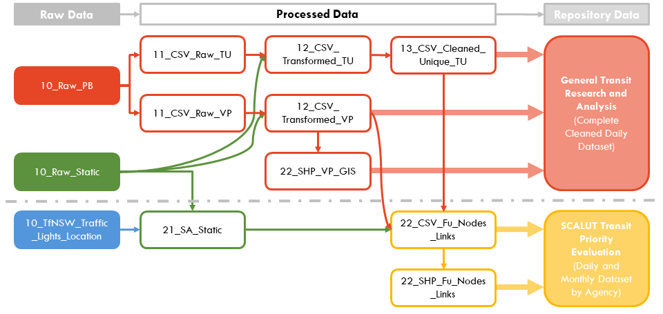

[](https://zenodo.org/badge/latestdoi/383683218)
# GTFS Data Pipeline for TfNSW Bus Datasets



## Table of Contents
* [Introduction](#introduction)
* [Data Availability Statement](#data-availability-statement)
* [Data Pipeline Directory Structure](#data-pipeline-directory-structure)
* [Data Pipeline Operations](#data-pipeline-operations)
  - 1.1 Convert .PB.GZ to .CSV Files
  - 1.2A Transform .CSV Files by Agency (Daily to Monthly)
  - 1.3 Prepare Cleaned Unique Datasets


## Introduction

**PhD Research Project Title:** Smart City Applications in Land Use and Transport (SCALUT)

This is a data pipeline developed as part of the PhD research project, SCALUT, at the University of Sydney's TransportLab.

The datasets generated using this pipeline has been used to validate the performance of TfNSW's Transit Signal Priority Request via Public Transport Information and Priority System (PTIPS).

The data pipeline is written in Python and has been tested to work on Windows, Linux and Mac using the Version 1 GTFS TfNSW Bus Datasets.

*Note: A seperate data pipeline is currently being developed and tested to work with a wider collection of GTFS datasets.*

## Installation
You can either download this file (or clone it) from Github, or you can install via pip with

```
pip install gtfs_dpl
```

## Data Availability Statement

The datasets generated will be made available to public on the University of Sydney Data Repository.

On-going static and realtime datasets are available on the Transport for NSW Open Data Hub:
* GTFS Static Datasets: https://opendata.transport.nsw.gov.au/dataset/timetables-complete-gtfs
* GTFS Realtime v1 Datasets:
  - Trip Update - https://opendata.transport.nsw.gov.au/dataset/public-transport-realtime-trip-update
  <!-- - Vehicle Position - https://opendata.transport.nsw.gov.au/dataset/public-transport-realtime-vehicle-positions -->


## Data Pipeline Directory Structure
```
GTFS_TfNSW_Bus_DataWareHouse
├───tfnsw_gtfs_realtime_pb2
├───tu_pb_to_csv
├───tu_pb_to_csv_folder
├───tu_transform_csv
├───tu_transform_csv_folder
├───tu_merge_csv
├───tu_all_steps
└───tu_all_steps_folder
```

## Usage instructions

### 1 Single-file processing

The following functions convert the SINGLE protobuf formatted GTFS-Realtime Trip Updates file into csv file.

#### 1.1 tu_pb_to_csv - Convert .pb.gz (Gzipped Protocol Buffer) to .csv.gz Files

This function converts the SINGLE protobuf formatted GTFS-Realtime Trip Updates file into csv file.

Suggested command:
```
tu_pb_to_csv.tu_pb_to_csv(<Input Gzipped Protocol Buffer Path>, <Output csv file path>)
```
Note: The *tfnsw_gtfs_realtime_pb2.py* file is required to be stored in the same folder.

#### 1.2 tu_transform_csv - Clean up .csv.gz Files

This function renames the columns and cleans up the converted csv file by removing unreasonable results.

Suggested command:
```
tu_transform_csv.tu_transform_csv(<Input csv file Path>, <Output csv file path>)
```

### 2 multi-file processing with intermediate outputs

The code in this step requires the following folder arrangement as input:
```
.../10_raw_pb_tu/month_layer/date_layer/files
```

Example:
```
.../10_raw_pb_tu/2020_06/gtfs_tu_2020_06_01/files # 2.1 tu_pb_to_csv input
.../11_raw_csv_tu/2020_06/gtfs_tu_2020_06_01/files # 2.2 tu_transform_csv input
.../12_csv_transformed_tu/2020_06/gtfs_tu_2020_06_01/files # 2.3 tu_merge_csv input
.../12_daily_tu/2020_06/gtfs_tu_2020_06_01_all.csv.gz # 2.3 tu_merge_csv output
```

#### 2.1 tu_pb_to_csv - Convert a folder of .pb.gz (Gzipped Protocol Buffer) to .csv.gz Files

This function converts a folder of protobuf formatted GTFS-Realtime Trip Updates file into csv file.
Each folder suggest to contain one day GTFS data.
This code use the multiprocessing function for a faster processing.

Suggested command:
```
python tu_pb_to_csv_folder.py <Input Gzipped Protocol Buffer folder Path>
```
Note: The *tfnsw_gtfs_realtime_pb2.py* file is required to be stored in the same folder.

#### 2.2 tu_transform_csv - Clean up a folder of .csv.gz Files

This function cleans a folder of csv files by renaming columns and removing unreasonable results.
Each folder suggest to contain one day GTFS data.
This code use the multiprocessing function for a faster processing.

Suggested command:
```
python tu_transform_csv_folder.py <Input csv file folder Path>
```

#### 2.3 tu_merge_csv - Merge a folder of .csv.gz Files

This function merges a folder of csv files into one daily csv file.
Each folder suggest to contain one day GTFS data.
This code use the multiprocessing function for a faster processing.

Suggested command:
```
python tu_merge_csv.py <Input csv file folder Path>
```

### 3 multi-file processing skipping intermediate outputs

The code in this step requires the following folder arrangement as input:
```
.../10_raw_pb_tu/month_layer/date_layer/files
```

Example:
```
.../10_raw_pb_tu/2020_06/gtfs_tu_2020_06_01/ # 2.1 tu_all_steps_folder input
```

#### 3.1 tu_all_steps_folder - Convert a folder of .pb.gz (Gzipped Protocol Buffer) to daily .csv.gz Files

This function converts a folder of protobuf files into fully cleaned csv files within one step.
Each folder suggest to contain one day GTFS data.
This code use the multiprocessing function for a faster processing.

Suggested command:
```
python tu_all_steps_folder.py <Input Gzipped Protocol Buffer folder Path>
```
Note: The *tfnsw_gtfs_realtime_pb2.py* file is required to be stored in the same folder.


<!-- **1.1 -Convert .pb.gz (Gzipped Protocol Buffer) to .csv.gz Files**
```
python TU_PBtoCSV.py <DataDir> <FileTP>
python VP_PBtoCSV.py <DataDir> <FileTP>
```


**1.2 Transform .CSV Files**
```
python TU_Transform.py <DataDir> <FileTP> <FileIdStatic>
python VP_Transform.py <DataDir> <FileTP>
```
**1.2A Transform .CSV Files by Agency (Daily to Monthly)**
```
python VP_Transform_byAgency.py <DataDir> <FileTP> <FileIdStatic> <DaysInMonth> <Flt_Agency>
```
**1.3 Prepare Cleaned Unique Datasets**
```
python TU_ClnUnique_byAgency.py <DataDir> <FileTP> <FileIdStatic> <DaysInMonth> <Flt_Agency>
```

## Usage example
The package comes with some data for you to explore. If you installed the package via `pip` you can find the path to the data with the following command under the category "Location":

```
pip show gtfs_dpl
```

To process the example data included with the package, you can run:

```
python TU_PBtoCSV.py /path/to/gtfs_dpl/example_data/ <FileTP>
python VP_PBtoCSV.py /path/to/gtfs_dpl/example_data/ <FileTP>
python TU_Transform.py /path/to/gtfs_dpl/example_data/ <FileTP> <FileIdStatic>
python VP_Transform.py /path/to/gtfs_dpl/example_data/<FileTP>
python VP_Transform_byAgency.py /path/to/gtfs_dpl/example_data/ <FileTP> <FileIdStatic> <DaysInMonth> <Flt_Agency>
python TU_ClnUnique_byAgency.py /path/to/gtfs_dpl/example_data/ <FileTP> <FileIdStatic> <DaysInMonth> <Flt_Agency>
``` -->
